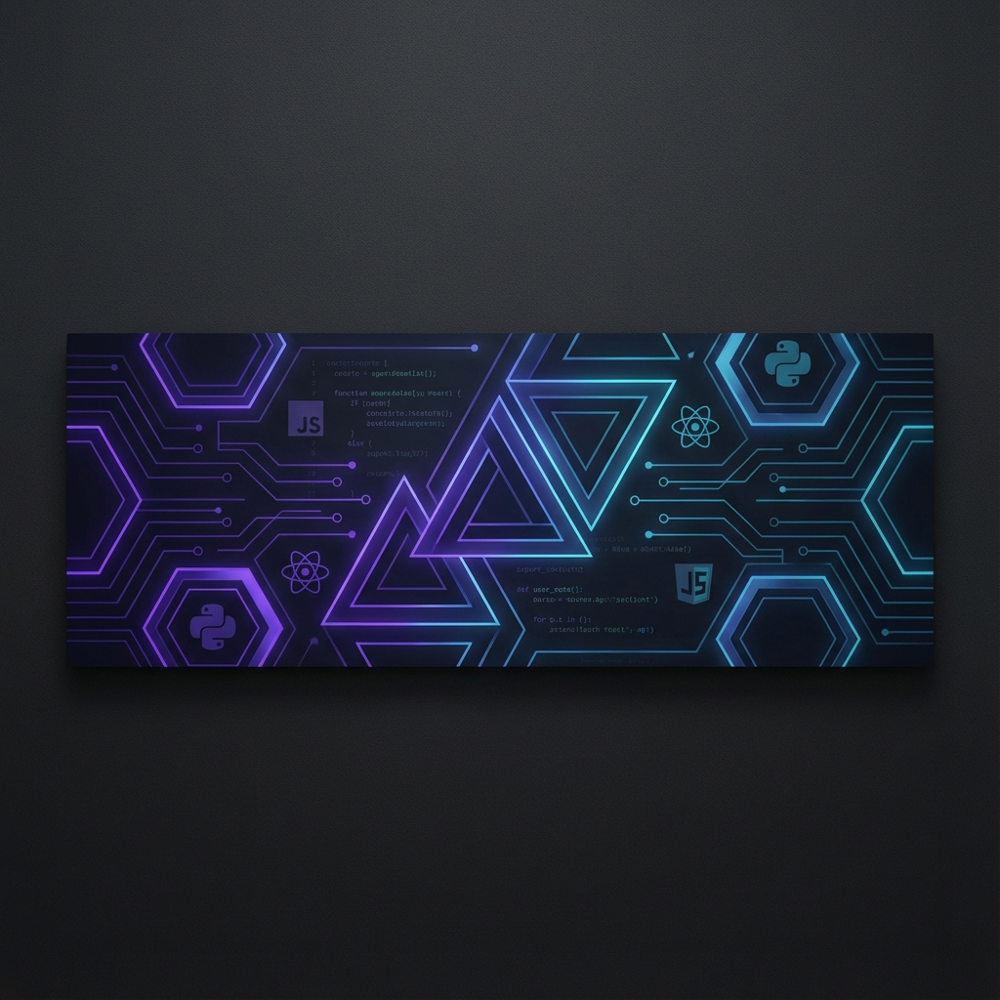

  
  
   
  
  <!-- Typing Animation -->
  

   

  

    
    
    
  

---

### � About Me

- � I’m a passionate developer from **Indonesia**
- � Working on **Web Development & Systems**
- 🌱 Learning **AI Integration & Cloud Computing**
- ⚡ Fun fact: **I turn coffee into code** ☕

---

### 🛠️ Tech Stack

  
  **Languages**
   
  
  
  
  
  
     
  
  **Frameworks & Libraries**
   
  
  
  
  
  

   

**Tools & Environment**
 

---

### 📊 GitHub Activity

<!-- GitHub Activity Graph -->

  

 

  
  

 

  <!-- Streak Stats in a cool grid -->
  

 

<!-- Snake Animation Placeholder (Requires Action) -->

  

---

  
<i>Give a ⭐️ to this repository if you like it!</i>

  

